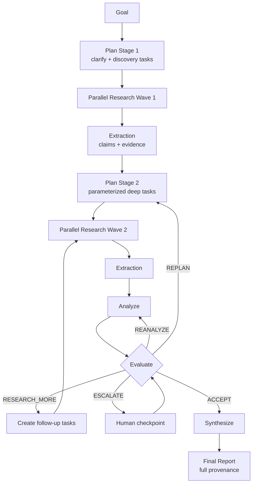
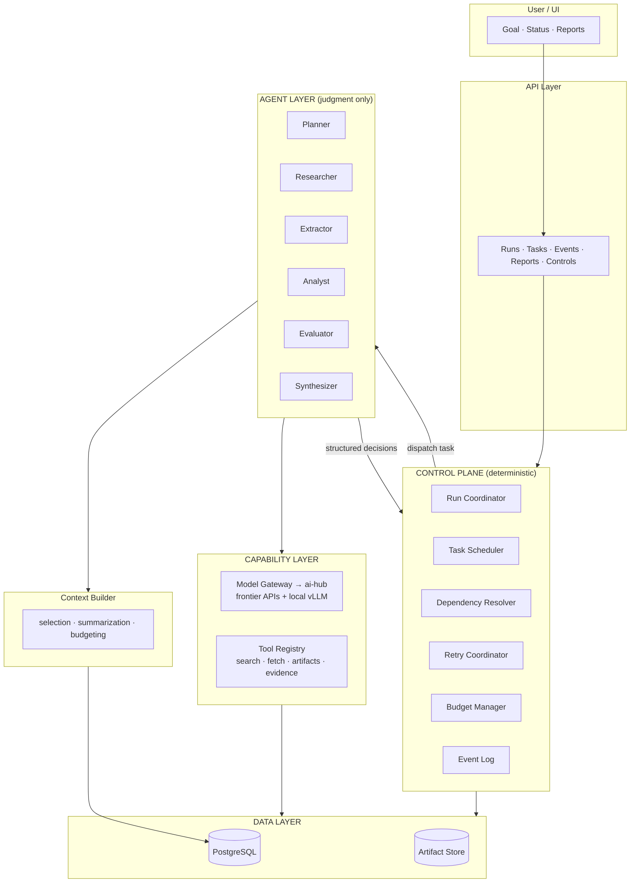
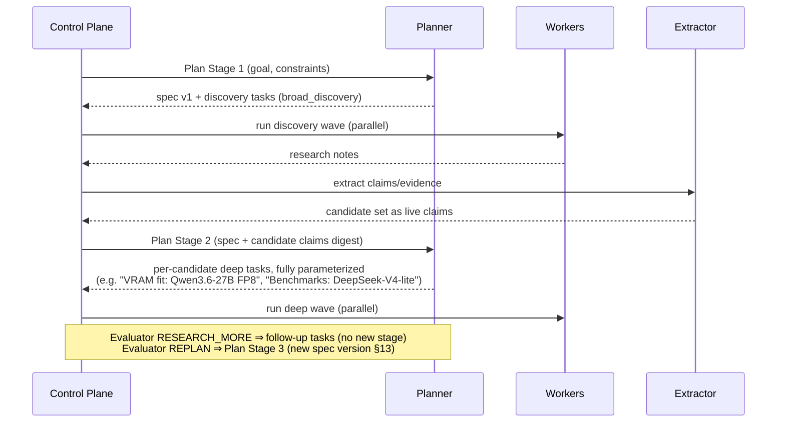
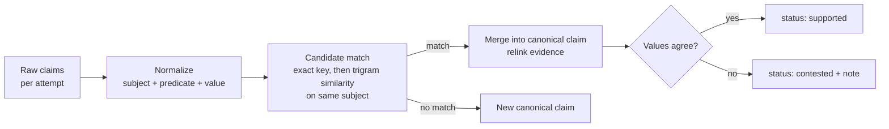
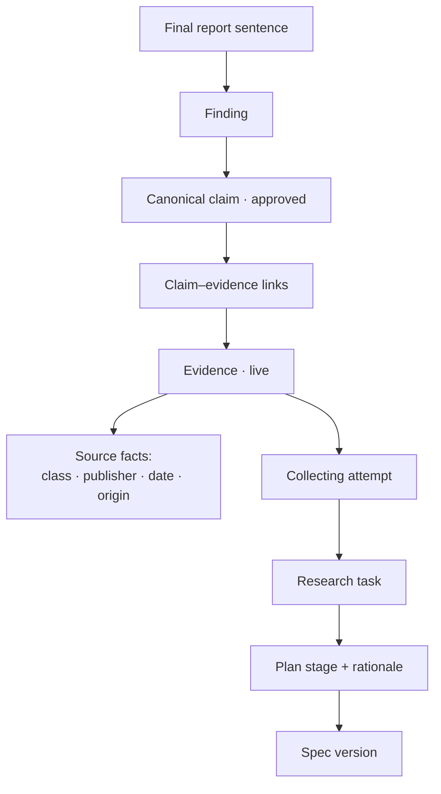

# AI Research Lab — System Design

**Version:** 0.2.1 (UI-driven addendum)
**Date:** 2026-08-19
**Status:** Implementation-Ready Design
**Supersedes:** v0.2 Refined
**Primary implementation language:** TypeScript

---

# 0. What Changed From v0.1

v0.1 had the right architecture and the wrong sequencing. The core thesis is unchanged:

> **Code manages the process. Agents make intelligent decisions. The database stores truth.**

v0.2 makes ten deliberate revisions. Each is recorded here so the reasoning survives.

| # | Change | Why |
|---|---|---|
| R1 | **Director merged into Planner** as a "clarify" stage of staged planning | Director and Planner shared one decision boundary ("what should we do?"). Two frontier calls, one job. |
| R2 | **Critic + Judge merged into a single Evaluator** for V0.05–V0.1 | Both answered "is this good enough, and what's missing?" and emitted the same decision vocabulary. Split later only if transcript evidence shows they would diverge. |
| R3 | **Staged planning replaces the static pre-created DAG** | v0.1 never specified how T100's output (candidate list) parameterizes T101–T106, which were created before candidates were known. Planning now happens in stages, after each wave of results. |
| R4 | **Two-pass research: free-form Research pass → structured Extraction pass** | Asking a local model to do a messy multi-tool research session AND emit strictly-valid JSON in one shot is the highest-failure-rate contract in v0.1. Splitting decouples "did the research work" from "did the JSON parse," and extraction can use guided decoding for near-zero schema failures. |
| R5 | **Evidence quality: categorical facts, not float scores** | `reliabilityScore: 0.7` assigned by an LLM at extraction time is pseudo-precision. Store facts (source class, publisher, date, vendor-affiliated?) and let the Evaluator reason over them at judgment time. |
| R6 | **Claim canonicalization added** | Two research tasks will both assert "Model X is 32B params" as separate rows. Without EXTRACT → RESOLVE → UPSERT, the claims table becomes noise. |
| R7 | **Attempt idempotency defined** | A crashed attempt may already have written evidence rows. Retries must supersede, not duplicate. All side effects are tagged by `attempt_id`; only side effects of an ACCEPTED attempt are live. |
| R8 | **Context Builder promoted to a first-class subsystem** with its own design | Context selection is where output quality is actually won or lost — more than agent role design. It got one page in v0.1. |
| R9 | **Spec versioning semantics defined** | The `version` column existed with no rules for when a new version is created or which version tasks bind to. |
| R10 | **Explicit cost/latency/concurrency model** | One loop is 40–80 model calls. A single GPU serializes "parallel" research. Budget this up front instead of discovering it. |

**v0.2 → v0.2.1:** building the run-console mockup (`research-lab-console.html`, group `ai-research-lab`) exposed under-specified read-side requirements. Five additions — R11 persist reasoning, R12 verbatim context snapshots, R13 trace read model + read API, R14 citation map + validator, R15 UI spec locked to the mockup — are captured in §24 without altering any v0.2 architecture decision.

Scope is re-cut into **V0.05 (minimal proven loop) → V0.1 (quality loop) → V0.2+ (reliability & scale)**. Everything cut from V0.05 is an upgrade to a working system, not a prerequisite for one.

---

# 1. Executive Summary

AI Research Lab is a long-running, stateful, multi-agent research system that transforms a high-level research goal into a traceable, evidence-backed report with minimal user intervention.

It is **not** autonomous chatbots talking to each other. It is a deterministic **Control Plane** (tasks, state, retries, dependencies, artifacts, budgets, events) with LLM **Agents** invoked only at judgment points: planning, research, extraction, analysis, evaluation, synthesis.

The proof-point milestone — unchanged from v0.1 — is:

> **The Evaluator discovers a missing piece of evidence that was not in the original plan, the system autonomously creates a new research task, executes it, updates its analysis, and the Evaluator later accepts the improved result.**

The core loop:



---

# 2. Core Design Principles

Unchanged from v0.1, restated tightly, with two additions (P8, P9).

- **P1 — Database is the source of truth.** LLM memory is never authoritative. Runs, tasks, attempts, claims, evidence, evaluations, decisions, budgets, events live in Postgres.
- **P2 — LLMs do not manage process state.** No agent is asked to remember which task is running, how many retries occurred, or whether a dependency is satisfied.
- **P3 — Agents communicate through artifacts and structured records**, never through remembered conversation. `Task → Attempt → Artifact → Claim → Evidence → Evaluation → Decision`.
- **P4 — Control-relevant outputs must be schema-validated.** Free-form prose is stored as an artifact but never drives control flow directly.
- **P5 — Failure is a normal state.** Retry, restrategize, remodel, block, replan, escalate, accept-partial, stop — all are ordinary transitions.
- **P6 — Evaluation is first-class.** No output is trusted because the model returned 200 OK.
- **P7 — Human intervention is explicit and rare** — reserved for defined checkpoints.
- **P8 — Separate "did it run" from "is it right" from "is it parseable."** *(new)* Infrastructure success, semantic quality, and schema validity are three independent axes with three independent recovery paths. The two-pass research design (R4) is this principle applied.
- **P9 — Side effects belong to attempts.** *(new)* Every row an attempt writes (evidence, claims, artifacts) carries its `attempt_id`. Only rows from ACCEPTED attempts are visible to downstream agents. This is what makes retries safe (see §11).

---

# 3. Scope

## 3.1 V0.05 — Minimal Proven Loop (build this first)

The smallest system that hits the proof-point milestone:

- Research run lifecycle + cancellation
- **Planner** (with clarify stage), **Researcher** (two-pass), **Extractor**, **Analyst**, **Evaluator** (merged critic/judge), **Synthesizer** — 5 agent roles, 6 including Extractor
- Staged planning (2 stages: discovery → deep)
- Deterministic task engine: statuses, dependencies, atomic claim, attempts
- Model gateway (frontier + local OpenAI-compatible), routed through **ai-hub**
- Tools: web search, web fetch, artifact read/write, evidence query
- Claims + evidence with provenance, claim canonicalization (exact/near-dup only)
- One dynamic follow-up loop (Evaluator → new tasks → re-research → re-evaluate)
- Infrastructure retries (backoff) + one intelligence-retry policy (strategy change, then model escalation)
- Event log, run timeline API, restart-safe state

## 3.2 V0.1 — Quality Loop

- Split Evaluator into **Critic** and **Judge** *if and only if* V0.05 transcripts show the merged role conflating "find flaws" with "gate the run"
- Contradiction as a first-class entity (V0.05 uses `contested` claim status + note)
- Richer research strategies; strategy-aware intelligence retries
- Evidence deduplication across dependent sources (vendor-echo clustering)
- Best-of-N for selected high-priority tasks (modes: `single`, `best_of_n`)
- Run dashboard UI: DAG, timeline, task inspector, evidence browser, report viewer
- Budget enforcement (USD, tokens, wall-clock, attempts)

## 3.3 V0.2+ — Reliability & Scale

- `diverse_strategies` / `multi_model` / `debate` ensemble modes
- Learned model routing from empirical per-task performance
- Durable execution (Temporal) when runs span hours/days with late-arriving human signals
- Cross-run memory (trusted sources, benchmark caveats, model performance history)
- Research templates; continuous/monitoring runs; experiment agent

## 3.4 Explicitly Out of Scope (all versions until proven needed)

Agent personalities, avatars, free-form agent-to-agent chat, Kubernetes, vector DB by default, multi-user RBAC, fine-tuning, autonomous real-world actions, payments, 20+ specialized agents.

---

# 4. High-Level Architecture



The Control Plane owns run/task/attempt lifecycle, readiness, claiming, retries, dynamic task insertion, cancellation, budgets, and events. It **never** decides which research question matters, whether a benchmark is meaningful, or whether a conclusion is weak. Agents decide those — and agents never mutate control state directly; they return validated decisions the Control Plane interprets.

---

# 5. Terminology (delta from v0.1)

Unchanged: **Research Run**, **Task**, **Attempt**, **Agent**, **Worker**, **Tool**, **Artifact**, **Claim**, **Evidence**, **Evaluation**, **Decision**.

New / revised:

- **Plan Stage** — one planning invocation. A run has ≥2 stages: Stage 1 produces discovery tasks; Stage N produces tasks parameterized by prior results. Replanning creates another stage.
- **Research Note** — the free-form artifact a Researcher produces (pass 1). Prose + raw source captures. Never drives control flow.
- **Extraction** — the structured pass that converts a Research Note into validated claims + evidence (pass 2).
- **Canonical Claim** — the deduplicated claim record that evidence links against. Raw claims from attempts resolve into canonical claims (§10).
- **Live side effect** — a claim/evidence/artifact row belonging to an ACCEPTED attempt. Non-live rows exist for audit but are invisible to downstream agents (§11).

---

# 6. Agent Roles (revised)

Five judgment roles plus one mechanical-LLM role. Every role owns a distinct decision boundary — the v0.1 anti-pattern test ("does this role own a decision no other role owns?") is applied to our own roster.

| Role | Decision boundary | Default tier | Notes |
|---|---|---|---|
| Planner | *What work should exist, in what order, with what success criteria?* | frontier | Absorbs Director as a clarify stage |
| Researcher | *What does the world say about this narrow question?* | strong_local | Pass 1: free-form, tool-heavy |
| Extractor | *What discrete claims and evidence does this note contain?* | fast_local (guided decoding) | Pass 2: mechanical, schema-guaranteed |
| Analyst | *What does the evidence mean for this user's goal?* | strong_local | Reads only live claims/evidence |
| Evaluator | *Is this good enough? If not, exactly what is missing?* | frontier | Merged Critic+Judge (V0.05) |
| Synthesizer | *How is the approved material best communicated?* | frontier | May not introduce unlinked facts |

## 6.1 Planner (with clarify stage)

**Input**

```ts
interface PlannerInput {
  userRequest: string;
  suppliedConstraints?: string[];
  specification?: ResearchSpecification; // absent on stage 1
  planStage: number;
  completedTaskSummaries?: TaskResultSummary[]; // stage ≥ 2
  liveClaimDigest?: string;                     // Context Builder product
  evaluatorFeedback?: EvaluatorOutput;          // on REPLAN
  availableCapabilities: CapabilitySummary[];
}
```

**Output**

```ts
interface PlannerOutput {
  specification: ResearchSpecification;   // created on stage 1, versioned after (§13)
  clarificationsAssumed: string[];        // ambiguities resolved by inference — surfaced, not hidden
  humanQuestions?: HumanCheckpointRequest[]; // ONLY for unsafe-to-infer ambiguity
  planDelta: PlanDelta;                   // always a delta, even on stage 1
}

interface PlanDelta {
  addTasks: PlannedTask[];
  cancelTaskIds: string[];
  supersedeTaskIds: string[];
  rationale: string;
}

interface PlannedTask {
  localId: string;
  type: TaskType;
  title: string;
  description: string;
  researchQuestion?: string;
  strategy?: ResearchStrategy;
  priority: number;                 // 0–100
  dependencies: string[];           // localIds or existing task UUIDs
  successCriteria: string[];        // checkable by Evaluator
  suggestedModelTier?: ModelTier;
  parallelizable: boolean;
  input: Record<string, unknown>;   // fully concrete — see staged planning §7
}
```

The clarify behavior replaces the Director: on stage 1 the Planner formalizes objective, scope, exclusions, success criteria, and key questions **inside** `specification`, records inferred assumptions in `clarificationsAssumed`, and only emits `humanQuestions` when inference would be unsafe (conflicting constraints, irreversible cost). One frontier call instead of two.

## 6.2 Researcher — Pass 1 (free-form)

**Contract change (R4):** the Researcher's output is a **Research Note artifact**, not structured claims.

```ts
interface ResearcherInput {
  question: string;
  strategy: ResearchStrategy;
  successCriteria: string[];
  liveEvidenceDigest?: string;   // avoid re-collecting what we have
  excludedSources?: string[];
  timeContext: string;           // current date; recency requirements
}

interface ResearcherOutput {
  noteArtifactId: string;        // markdown note: findings, quotes, URLs, dead ends
  sourcesVisited: SourceVisit[]; // mechanical log from tool layer, not model memory
  selfAssessment: {
    complete: boolean;
    confidence: "low" | "medium" | "high";
    gaps: string[];
  };
}
```

The note has a light template (Question / Method / Findings / Sources / Contradictions noticed / Gaps) but is prose. The model spends its capacity on research, not JSON discipline. `sourcesVisited` comes from the tool layer's own log — the model cannot forget or invent a URL it fetched.

```ts
type ResearchStrategy =
  | "broad_discovery"        // stage-1 discovery tasks
  | "primary_sources"
  | "benchmark_focused"
  | "community_evidence"
  | "independent_validation"
  | "comparative";
// "experimental" deferred to V0.2 (experiment agent)
```

## 6.3 Extractor — Pass 2 (structured, guaranteed)

Runs automatically after every successful Researcher attempt, as a separate task the Control Plane creates (`type: "extract"`, depends on the research task).

```ts
interface ExtractorInput {
  noteArtifactId: string;
  sourcesVisited: SourceVisit[];
  question: string;
}

interface ExtractorOutput {
  claims: ProposedClaim[];      // statement, type, confidence, sourceRefs
  evidence: ProposedEvidence[]; // excerpt, source facts (§9), claim links
  contradictionsNoticed: { subject: string; claimRefs: string[] }[];
  unanswered: string[];
}
```

Runs on a fast local model with **guided decoding** (vLLM structured output / JSON schema mode), making schema failure a near-impossibility rather than a retry category. If the note is garbage, extraction yields few claims — which the deterministic minimum-evidence check then catches. Each failure mode has exactly one owner (P8):

| Failure | Detected by | Recovery |
|---|---|---|
| Tools/model errored | infra layer | infrastructure retry (backoff) |
| Note is thin/off-target | deterministic checks + Evaluator | intelligence retry (new strategy/model) |
| JSON invalid | guided decoding prevents; else schema check | re-extract (cheap), never re-research |

## 6.4 Analyst

Unchanged in spirit. Reads **only live** canonical claims + evidence (P9), via the Context Builder.

```ts
interface AnalystInput {
  specification: ResearchSpecification;
  claimBundle: CanonicalClaimView[];   // claims + linked evidence + source facts
  openContests: ContestedClaimView[];  // V0.05 contradiction representation
}

interface AnalysisOutput {
  findings: Finding[];        // each cites canonicalClaimIds
  comparisons: Comparison[];
  unresolvedQuestions: string[];
  confidenceNote: string;     // prose calibration, not a fake float
}
```

Findings must cite claim IDs. A finding with zero citations is a schema failure.

## 6.5 Evaluator (merged Critic + Judge)

One frontier call per cycle answering both questions v0.1 split across two agents.

```ts
interface EvaluatorInput {
  specification: ResearchSpecification;
  analysis: AnalysisOutput;
  claimBundle: CanonicalClaimView[];
  coverage: CoverageSummary;      // deterministic: per key-question evidence counts,
                                  // source-class mix, vendor-affiliation ratio, recency
  runMetrics: RunMetrics;         // attempts used, budget consumed, cycles completed
}

interface EvaluatorOutput {
  issues: EvaluatorIssue[];       // the "critic" half
  decision: "ACCEPT" | "RESEARCH_MORE" | "REANALYZE" | "REPLAN" | "ESCALATE" | "STOP";
  reasons: string[];
  requiredActions: RequiredAction[];  // concrete: research questions, strategy hints
  acceptedUncertainties: string[];    // uncertainty consciously accepted, surfaced in report
}

interface EvaluatorIssue {
  severity: "low" | "medium" | "high" | "critical";
  category: "source_quality" | "missing_evidence" | "contradiction"
          | "reasoning" | "scope" | "recency" | "benchmark_validity" | "bias" | "other";
  description: string;
  suggestedResearchQuestion?: string;
}
```

**Rules:**
- The Evaluator receives the deterministic `coverage` summary so it reasons over computed facts (source diversity, vendor ratio) rather than recounting evidence itself.
- Its output never mutates tasks; the Control Plane interprets `decision` + `requiredActions`.
- **Cycle guard (deterministic, not the Evaluator's job):** max N evaluation cycles per run (default 3). On exceeding, the Control Plane forces `ESCALATE` or accept-with-uncertainties per run policy. An LLM must never be the only thing standing between the system and an infinite research loop.

*Split criterion for V0.1:* if transcripts show the merged role rubber-stamping its own issue list (finding flaws, then accepting anyway without resolution) — that's the evidence that adversarial critique and gating need separate contexts, possibly separate models.

## 6.6 Synthesizer

Unchanged: receives only approved analysis + live claims/evidence; may not introduce facts that cannot be linked to an approved claim. Every factual sentence in the report carries claim references (rendered as citations). `acceptedUncertainties` from the Evaluator must appear in the report's uncertainty section — accepted uncertainty is a promise to the user, not a footnote to drop.

---

# 7. Staged Planning (fixes the DAG parameterization gap)

**The v0.1 gap:** the plan created T101–T106 ("Official specs", "Benchmarks"…) *before* T100 ("Candidate discovery") had produced the candidate list those tasks needed as input. No mechanism existed to inject T100's output into T101's input.

**The v0.2 rule:** *a task is only created when its input can be fully concrete.* Planning is therefore staged, and the DAG grows in waves.



Consequences:

- **No input templating machinery needed.** v0.1 would have required a template language ("for each candidate in {T100.output.candidates}…"). Staged planning deletes that entire problem: the Planner reads results and writes concrete inputs.
- **Stage 1 is cheap and fast** (1–2 discovery tasks), so the second frontier planning call arrives with real material.
- `RESEARCH_MORE` follow-ups are created directly by the Control Plane from `requiredActions` (each action → one task) — no Planner call needed. `REPLAN` invokes the Planner with full state and yields a `PlanDelta` (never overwrite history — supersede).
- The dependency graph is still a DAG at all times; it just isn't fully known at T0. This mirrors how a human research lead actually works.

---

# 8. Task System

## 8.1 Task Types & Status

```ts
type TaskType =
  | "plan"        // Planner stage
  | "research"    // Researcher pass 1
  | "extract"     // Extractor pass 2 (auto-created)
  | "analyze"
  | "evaluate"
  | "synthesize"
  | "human_review";

type TaskStatus =
  | "CREATED" | "READY" | "RUNNING" | "EVALUATING"
  | "DONE" | "FAILED" | "BLOCKED" | "WAITING_HUMAN" | "CANCELLED";
```



```mermaid
stateDiagram-v2
    [*] --> CREATED
    CREATED --> READY: deps DONE ∧ run active ∧ budget ok
    READY --> RUNNING: worker atomic claim
    RUNNING --> EVALUATING: agent returned
    EVALUATING --> DONE: accepted
    EVALUATING --> READY: retryable (infra or intelligence)
    EVALUATING --> BLOCKED: dependency failed / no viable path
    EVALUATING --> WAITING_HUMAN: checkpoint required
    EVALUATING --> FAILED: attempts exhausted / terminal
    RUNNING --> EVALUATING: stale claim released (worker died; amended P1.3 — see §8.3)
    CREATED --> CANCELLED
    READY --> CANCELLED
    RUNNING --> CANCELLED
    BLOCKED --> CANCELLED
```

Readiness = all required dependencies DONE ∧ run active ∧ not cancelled ∧ attempt budget remaining ∧ run budget not exceeded.

## 8.2 Run State Machine

Run phases collapse to what the staged loop actually needs:

```ts
type ResearchRunStatus =
  | "CREATED" | "PLANNING" | "RESEARCHING" | "ANALYZING"
  | "EVALUATING" | "SYNTHESIZING" | "WAITING_HUMAN"
  | "COMPLETED" | "FAILED" | "CANCELLED";
// v0.1's DIRECTING removed (R1); REVIEWING renamed EVALUATING (R2)
```

## 8.3 Worker Loop & Atomic Claim

Unchanged from v0.1 and correct: poll → `SELECT … FOR UPDATE SKIP LOCKED` → claim → create attempt → resolve agent/model → build context → run → persist → `EVALUATING` → events. Stale-claim release: a scheduler sweep marks the attempt of a task RUNNING past `claim_timeout` FAILED (`TRANSIENT_INFRA`), relying on §11 idempotency for safety.

> **Amended 2026-08-19 (P1.3, Phase 1 gate finding):** stale release parks the task in `EVALUATING`, not `READY`. Returning straight to READY bypassed the retry ladder (CLAUDE.md rule 10) — neither backoff nor `max_attempts` applied, and a `claim_timeout` shorter than a task's work time produced an unbounded reclaim loop. The Retry Coordinator now rules on every re-run; `RUNNING → READY` remains a legal transition but is currently unused.

## 8.4 Attempts

```ts
type AttemptStatus =
  | "CREATED" | "RUNNING" | "SUCCEEDED"   // agent returned + schema valid
  | "FAILED"                               // infra/schema/tool failure
  | "ACCEPTED" | "REJECTED"                // quality verdict on a SUCCEEDED attempt
  | "SUPERSEDED"                           // replaced by a later accepted attempt (new)
  | "CANCELLED";
```

`SUPERSEDED` is new and load-bearing: it is how side effects of an earlier attempt are retired without deletion (§11).

---

# 9. Evidence Model (categorical facts, not floats)

**The v0.1 problem:** `reliabilityScore: 0.7` assigned at extraction time is a number that looks like data but is vibes, and it bakes a judgment into storage that should be made at evaluation time with full context.

**The v0.2 rule:** *store facts at collection time; make judgments at evaluation time.*

```ts
interface Evidence {
  id: string;
  runId: string;
  taskId: string;
  attemptId: string;          // side-effect ownership (P9)

  // ---- facts (deterministic or trivially extractable) ----
  sourceClass: "official_docs" | "paper" | "independent_benchmark"
             | "vendor_benchmark" | "news" | "community" | "user_supplied";
  sourceUrl?: string;
  sourceTitle?: string;
  publisher?: string;
  publishedAt?: Date;
  retrievedAt: Date;
  vendorAffiliated: boolean | null;   // is the source the vendor of the subject?
  benchmarkOrigin?: string;           // which underlying benchmark/dataset (dedup key)
  excerpt: string;                    // the actual supporting text

  artifactId?: string;                // page snapshot
  metadata: Record<string, unknown>;
}
```

No `reliabilityScore`, `freshnessScore`, `independenceScore` columns. Instead, the deterministic `CoverageSummary` computes, per key question: evidence count, source-class mix, vendor-affiliation ratio, distinct-publisher count, distinct `benchmarkOrigin` count, and age distribution — and the Evaluator reasons over those computed facts. If V0.2 later wants numeric priors for ranking, they are derived views over the facts, configurable, and never stored on the evidence row.

`benchmarkOrigin` is the seed of V0.1 vendor-echo deduplication: ten articles citing the same vendor benchmark share one origin and count as one independent source, not ten.

---

# 10. Claim Canonicalization

**The v0.1 problem:** T101 and T102 both assert "Qwen3.6-27B has 27B parameters" as separate claim rows; evidence links scatter across duplicates; coverage counts inflate; the Analyst reads noise.

**The v0.2 pipeline** (same EXTRACT → RESOLVE → UPSERT → LINK shape as Juicer's entity resolution, scoped down):



- Raw claims are kept (audit, attributed to their attempt); **canonical claims** are what Analyst/Evaluator/Synthesizer see.
- V0.05 matching is deliberately dumb: normalized exact match on `(subjectKey, predicateKey)`, plus `pg_trgm` similarity as a candidate filter with the Extractor's fast model confirming merges in batch. No embeddings, no LanceDB — add semantic matching in V0.1 only if trigram misses hurt in practice.
- Conflicting values on one canonical claim ⇒ `contested` + a note listing the disagreeing evidence. That **is** the V0.05 contradiction system. The first-class `Contradiction` entity with severities and resolution workflow arrives in V0.1, seeded from contested claims.

```ts
interface CanonicalClaim {
  id: string;
  runId: string;
  subjectKey: string;      // e.g. "model:qwen3.6-27b"
  predicateKey: string;    // e.g. "param_count"
  statement: string;       // best current phrasing
  type: "fact" | "comparison" | "inference" | "recommendation" | "uncertainty";
  status: "proposed" | "supported" | "contested" | "rejected" | "approved";
  contestNote?: string;
  createdAt: Date;
  updatedAt: Date;
}
// claim_evidence_links: (canonicalClaimId, evidenceId, relation: supports|contradicts|context)
// raw_claims: kept with attemptId → canonicalClaimId mapping
```

---

# 11. Attempt Idempotency & Side-Effect Safety (new)

**The scenario v0.1 didn't address:** attempt #1 of a research task writes 12 evidence rows, then the worker dies before completing. Attempt #2 runs. Do we now have duplicates? Does the Analyst see half-finished garbage?

**The rules:**

1. Every side-effect row (evidence, raw claim, artifact) carries its `attempt_id` (P9).
2. Side effects are **live** only when their attempt is `ACCEPTED`.
3. Context Builder, coverage computation, and all downstream agents query live rows only.
4. When a retry attempt is ACCEPTED, prior SUCCEEDED/FAILED attempts for the task become `SUPERSEDED` — their side effects go dark atomically, in one transaction, without deletion.
5. Canonicalization (§10) runs only over live raw claims, and re-runs (cheap, deterministic + batch confirm) when the live set changes.
6. Artifacts are immutable and content-addressed (sha256); a re-fetched identical page dedupes at the store.

Result: a crashed or rejected attempt can never corrupt what downstream agents see; retries are safe by construction, not by cleanup code.

---

# 12. Context Builder (promoted to first-class)

This subsystem determines output quality more than agent role design does. It deserves its own contract and its own design doc (§20).

```ts
interface ContextBuilder {
  forPlanner(runId: string, stage: number): Promise<PlannerInput>;
  forResearcher(taskId: string): Promise<ResearcherInput>;
  forAnalyst(runId: string): Promise<AnalystInput>;
  forEvaluator(runId: string): Promise<EvaluatorInput>;
  forSynthesizer(runId: string): Promise<SynthesizerInput>;
}
```

**Selection rules (V0.05):**

- **Planner (stage ≥ 2):** spec + one-paragraph result summary per completed task + *claim digest* (canonical claims grouped by subject, contested flagged) — not raw evidence.
- **Researcher:** its question, strategy, success criteria + digest of live evidence *on its subject only* (to avoid re-collection) + excluded sources. Never other tasks' notes.
- **Analyst:** all live canonical claims with, per claim, up to K strongest evidence items (V0.05 heuristic: prefer distinct `benchmarkOrigin`, non-vendor-affiliated, most recent; K=3) + all contested claims with their full disagreement.
- **Evaluator:** analysis + claim digest + deterministic `CoverageSummary` + run metrics. The Evaluator gets computed facts, not raw evidence dumps.
- **Synthesizer:** approved analysis + live claims + citation-ready evidence references.

**Budgeting:** each agent role has a token budget. Overflow order: drop `context`-relation evidence first → tighten per-claim evidence K → summarize note artifacts → **never** drop the specification, success criteria, contested claims, or Evaluator required-actions. If a hard constraint would be dropped, fail the context build loudly (that's a task sizing bug, not something to hide).

**On-demand retrieval (V0.1):** give Analyst/Evaluator an `evidence_query` tool so context can start lean and deepen on demand, instead of front-loading everything.

---

# 13. Specification Versioning (semantics defined)

The `research_specs.version` column now has rules:

- **v1** is created by Plan Stage 1.
- A new version is created **only** when the objective, scope, exclusions, or success criteria change — i.e., on `REPLAN` where the Planner amends the spec, or on a human checkpoint answer that alters scope. Stage-2 planning that merely adds tasks does **not** version the spec.
- Every task stores `spec_version` at creation. When a new spec version lands, the Control Plane asks the Planner (in the same REPLAN call) which in-flight tasks the change invalidates → those are superseded in the `PlanDelta`. Tasks not invalidated keep running under their original version — their evidence remains valid; only interpretation changes.
- The final report cites the spec version it was synthesized under, and the run timeline shows each version transition with its rationale (a `DecisionRecord`).

---

# 14. Retry Architecture

Two axes, unchanged in principle, sharpened in policy.

**Infrastructure retry** (timeouts, 429/5xx, GPU offline, tool hiccups, DB blips): exponential backoff `5s → 30s → 2m`, same everything, max 3. Owned by the worker/Retry Coordinator. Never counts against intelligence-retry budget.

**Intelligence retry** (SUCCEEDED but quality-rejected): the Retry Coordinator applies a deterministic escalation ladder — the *decision to retry* comes from the Evaluator or deterministic checks; the *shape of the retry* comes from policy:

```text
research task, attempt 1 rejected:
  attempt 2 = same tier, different strategy (policy table maps strategy → fallback strategy)
  attempt 3 = escalate tier (strong_local → frontier), best prior strategy
  attempt 4 = none → task FAILED → Evaluator decides: proceed without / REPLAN / ESCALATE
```

Deterministic pre-checks run before any LLM evaluation and can trigger intelligence retry without spending an Evaluator call: minimum live-evidence count per research task (default 3), ≥1 non-vendor-affiliated source when the question is about a vendor's product, every finding cites ≥1 claim, self-assessment `complete=false` with high-severity gaps.

```ts
type ErrorCategory =
  | "TRANSIENT_INFRA" | "PERMANENT_INFRA" | "MODEL_FAILURE" | "TOOL_FAILURE"
  | "SCHEMA_FAILURE" | "QUALITY_FAILURE" | "BUDGET_EXCEEDED"
  | "CANCELLED" | "HUMAN_REQUIRED" | "UNKNOWN";
```

`SCHEMA_FAILURE` on extraction ⇒ re-extract only (cheap), never re-research (P8).

---

# 15. Model Gateway, Routing, and the Single-GPU Reality

## 15.1 Gateway

The `ModelClient` abstraction is unchanged from v0.1 (§10 there) and is deliberately shaped like **ai-hub**'s interface: OpenAI-compatible routing across frontier APIs and local vLLM, with per-call usage/cost/latency recording. Reuse ai-hub as the gateway rather than rebuilding it; the research system adds only the *router policy* layer on top. ai-hub's async-job pattern (queue + webhook) also maps cleanly onto long research attempts if local inference calls start hitting timeout territory.

Tiers: `frontier | strong_local | fast_local | cheap_remote`. Defaults per role are in §6's table; all routing is config, not code (a policy table keyed by `(role, priority band, attemptNumber)`), with the v0.1 warning kept: nested conditionals become a policy engine before they become unreadable.

## 15.2 Cost & Latency Budget (model this before building — R10)

Order-of-magnitude for one full run with staged planning, 2 discovery + 6 deep + 2 follow-up research tasks, 2 evaluation cycles:

| Component | Calls | Tier | Notes |
|---|---:|---|---|
| Plan stages 1–2 | 2 | frontier | |
| Research (pass 1) | ~10 tasks × 5–10 tool-loop steps | strong_local | dominant local load |
| Extraction (pass 2) | ~10 | fast_local | cheap, guided decoding |
| Canonical merge confirms | ~3 batches | fast_local | |
| Analyst | 2 | strong_local | |
| Evaluator | 2 | frontier | |
| Synthesizer | 1 | frontier | |
| **Total** | **~70–110 model calls** | | **~7 frontier calls** |

Frontier spend concentrates in ≤7 calls — that is where budget caps bite and where per-call quality matters most. Wall-clock: with the strong-local tier on a single RTX PRO 6000, "parallel" research tasks **serialize at the GPU** (vLLM continuous batching helps throughput, not single-stream latency, on 27B-class models with long contexts). Expect **20–45 minutes** per run. Set that expectation in the UI (phase + live event feed), and treat it as fine: this is a background research system, not chat.

**Concurrency policy:** logical task parallelism ≠ physical GPU parallelism. Workers claim freely; the gateway enforces a per-model concurrency cap (start: 2 concurrent strong_local requests) and queues the rest. Priority-ordered queue so Evaluator-demanded follow-ups jump ahead of speculative work.

## 15.3 Budgets

```ts
interface RunBudget {
  maxUsd?: number;             // frontier spend
  maxLocalComputeUnits?: number; // normalized local inference (tokens × model-size factor)
  maxModelCalls?: number;
  maxToolCalls?: number;
  maxEvaluationCycles?: number;  // the cycle guard, default 3
  maxDurationMs?: number;
}
```

Enforced by the Control Plane at task-readiness time and at gateway call time. On breach: run → `WAITING_HUMAN` with a checkpoint ("budget exhausted; accept current state / extend / cancel"), never a silent stop.

---

# 16. Tools, Permissions, Safety

Unchanged from v0.1 in structure; the allowlist tightens per revised roles:

```text
Planner      spec/claim digests only (via context)          — no live web tools
Researcher   web_search ✓  web_fetch ✓  artifact_write ✓    — no task/run mutation
Extractor    artifact_read ✓                                 — nothing else
Analyst      evidence_query ✓ (V0.1)  artifact_read ✓
Evaluator    evidence_query ✓ (V0.1)  artifact_read ✓        — no web (judges what was collected)
Synthesizer  artifact_read ✓  claim/evidence read ✓          — no web (cannot import uncited facts)
```

The Evaluator deliberately has **no web access**: it judges the evidence base, it does not quietly patch it — gaps must flow through `requiredActions` into visible tasks. Filesystem sandbox, no code-execution tool in V0.05, secrets never in prompts/artifacts/events: all as v0.1 §39.

---

# 17. Database Schema (delta from v0.1)

v0.1's schema stands with these changes:

```sql
-- CHANGED: evidence — drop float scores, add categorical facts
ALTER TABLE evidence
  DROP COLUMN reliability_score, DROP COLUMN freshness_score, DROP COLUMN independence_score,
  ADD COLUMN source_class TEXT NOT NULL,
  ADD COLUMN vendor_affiliated BOOLEAN,
  ADD COLUMN benchmark_origin TEXT;

-- NEW: canonical claims + raw claim mapping
CREATE TABLE canonical_claims (
  id UUID PRIMARY KEY,
  run_id UUID NOT NULL REFERENCES research_runs(id),
  subject_key TEXT NOT NULL,
  predicate_key TEXT NOT NULL,
  statement TEXT NOT NULL,
  type TEXT NOT NULL,
  status TEXT NOT NULL,
  contest_note TEXT,
  created_at TIMESTAMPTZ NOT NULL DEFAULT now(),
  updated_at TIMESTAMPTZ NOT NULL DEFAULT now(),
  UNIQUE (run_id, subject_key, predicate_key)
);
-- claims table becomes raw_claims: + canonical_claim_id UUID REFERENCES canonical_claims(id)
-- claim_evidence_links references canonical_claims

-- CHANGED: attempts — add SUPERSEDED to status domain; add index for liveness
CREATE INDEX idx_attempts_task_status ON attempts(task_id, status);
-- liveness view:
CREATE VIEW live_evidence AS
  SELECT e.* FROM evidence e JOIN attempts a ON a.id = e.attempt_id
  WHERE a.status = 'ACCEPTED';

-- CHANGED: research_tasks — bind spec version; extraction linkage
ALTER TABLE research_tasks
  ADD COLUMN spec_version INTEGER NOT NULL DEFAULT 1,
  ADD COLUMN plan_stage INTEGER NOT NULL DEFAULT 1;

-- NEW: plan_stages (one row per Planner invocation, holds PlanDelta + rationale)
CREATE TABLE plan_stages (
  id UUID PRIMARY KEY,
  run_id UUID NOT NULL REFERENCES research_runs(id),
  stage INTEGER NOT NULL,
  spec_version INTEGER NOT NULL,
  delta JSONB NOT NULL,
  rationale TEXT NOT NULL,
  created_at TIMESTAMPTZ NOT NULL DEFAULT now()
);

-- artifacts: + sha256 UNIQUE per run for content-addressed dedup (nullable)
-- contradictions table: DEFERRED to V0.1 (contested canonical claims cover V0.05)
```

Everything else (runs, specs, tasks, dependencies, attempts, evaluations, decisions, events, artifacts, model_calls, tool_calls) carries over as written in v0.1 §26.

---

# 18. Provenance (unchanged — the crown jewel)



v0.2 strengthens the chain: canonicalization means one claim node per fact (no scattered duplicates), liveness means every link points at accepted work, and plan-stage records mean even *why the task existed* is answerable. This provenance graph remains the highest-value long-term feature and the differentiator versus one-shot deep-research tools.

---

# 19. Roadmap (re-sequenced)

```mermaid
flowchart LR
    P0[P0 Foundation<br/>repo · db · migrations] --> P1[P1 Task Engine<br/>no LLM · fake handlers]
    P1 --> P2[P2 Gateway via ai-hub<br/>frontier + local + usage]
    P2 --> P3[P3 Plan+Research+Extract<br/>staged planning · two-pass]
    P3 --> P4[P4 Analyst + Evaluator<br/>+ dynamic follow-up tasks]
    P4 --> P5[P5 Synthesizer<br/>provenance report]
    P5 --> M{{V0.05 milestone:<br/>Evaluator gap → new task →<br/>improved result accepted}}
    M --> P6[P6 UI dashboard]
    P6 --> P7[P7 Critic/Judge split?<br/>best-of-N · contradictions · dedup]
    P7 --> P8[P8 Durable runtime<br/>only if needed]
```



Phase success tests:

- **P1:** create run → 5 fake tasks → deps unlock → 2 workers → run completes; kill a worker mid-task → stale claim released → retry succeeds → no duplicate live side effects.
- **P3:** question → stage-1 discovery → extraction → stage-2 parameterized tasks exist with concrete inputs (the R3 fix, verified).
- **P4:** *the milestone*: Evaluator identifies a real gap → system creates the task → executes → re-analysis → ACCEPT on cycle 2. Also verify the cycle guard by forcing a never-satisfied rubric.
- **P5:** end-to-end report where a random factual sentence traces to source in ≤4 clicks/queries.

Golden research tasks (regression suite from day one of P4): one product comparison with a known-ish answer, one contradiction-reconciliation case (vendor vs independent benchmark), one recency case. Track: evaluator cycles, retries, frontier calls, wall-clock, and whether the final recommendation survives human review.

---

# 20. V0.05 Definition of Done

A user submits a research question and the system autonomously executes:

```text
Create run → Plan stage 1 → discovery research → extract →
Plan stage 2 (parameterized) → parallel deep research → extract →
canonicalize → analyze → evaluate → RESEARCH_MORE →
new tasks created → research → extract → re-analyze → evaluate →
ACCEPT → synthesize → report with provenance
```

Acceptance criteria (v0.1's list, plus the new invariants):

- Every task has explicit status; every execution is an Attempt.
- **Every live claim/evidence row belongs to an ACCEPTED attempt; superseding is atomic.**
- **Every stage-2 task input is fully concrete (no templates, no placeholders).**
- **Extraction schema-failure rate ≈ 0 (guided decoding); note-quality failures route to intelligence retry, never to re-extraction loops.**
- Every report factual sentence links to an approved canonical claim → live evidence → source.
- A crashed worker cannot corrupt a run; restart of API/worker loses nothing.
- The cycle guard hard-stops runaway loops; budget breach yields a human checkpoint, not a silent stop.
- Event history explains the run end-to-end.

---

# 21. ADRs (updated)

```text
ADR-001 PostgreSQL as system of record                       (kept)
ADR-002 Task and Attempt are separate entities               (kept)
ADR-003 Agents never mutate control state directly           (kept)
ADR-004 Structured outputs required for control decisions    (kept)
ADR-005 Evidence is first-class                              (kept)
ADR-006 Agent communication via artifacts, not chat          (kept)
ADR-007 Model gateway is provider-independent (via ai-hub)   (amended)
ADR-008 Build orchestration runtime before agent frameworks  (kept)
ADR-009 Local models do volume; frontier models do gates     (kept)
ADR-010 Failure and retries are normal workflow states       (kept)
ADR-011 Staged planning: tasks created only when inputs are concrete   (new)
ADR-012 Two-pass research: free-form note, then guided extraction      (new)
ADR-013 Evidence stores facts; judgments happen at evaluation time     (new)
ADR-014 Side effects are attempt-owned; only accepted attempts are live (new)
ADR-015 Merged Evaluator until transcripts justify Critic/Judge split  (new)
ADR-016 Deterministic cycle guard caps autonomous loops                (new)
```

---

# 22. Open Questions (carried + new)

- **Planner granularity** (carried): task sizing heuristics — start with "one research task ≈ one question answerable in ≤10 tool steps," tune from golden-task data.
- **Evaluator trust** (carried, sharpened): the merged Evaluator + deterministic coverage facts + cycle guard is the V0.05 answer; multi-judge/cross-model comes only with evidence of need.
- **Canonicalization recall** (new): does trigram + batch-confirm miss real duplicates on messy subjects (model names with quant suffixes)? Measure in P3; escalate to embeddings only if measured.
- **Note template strictness** (new): how much structure in the Research Note helps extraction without re-imposing the JSON burden on pass 1?
- **Per-claim evidence K** (new): is K=3 strongest-evidence per claim enough for the Analyst, or does on-demand `evidence_query` need to arrive earlier than V0.1?
- **When RESEARCH_MORE becomes REPLAN** (carried): current rule — required actions answerable within existing scope ⇒ MORE; scope/success-criteria change needed ⇒ REPLAN. Validate against real runs.

---

# 23. Next Design Documents (revised order)

1. `task-engine.md` — state machines, claim algorithm, stale-claim sweep, crash recovery, liveness transactions (§11).
2. `context-builder.md` — *(promoted, was absent)* selection rules, digests, budgets, overflow policy per role.
3. `agent-contracts.md` — full Zod schemas, prompts, tool allowlists, guided-decoding schemas for extraction.
4. `database-schema.md` — full DDL incl. §17 deltas, indexes, liveness views, query patterns.
5. `execution-trace-v005.md` — one simulated run with real JSON at every stage, including a crash + supersede.
6. `model-routing.md` — policy tables, escalation ladder, GPU concurrency caps, ai-hub integration.
7. `evaluation-framework.md` — Evaluator rubric, deterministic coverage computation, cycle guard.
8. `implementation-plan.md` — repo init, milestones, tickets, golden tasks, failure-injection matrix.
9. `read-api-and-ui-spec.md` — trace assembly, transcript pagination, SSE stream, citation map; the console mockup is the normative reference (§24.6).

---

---

# 24. v0.2.1 Addendum — Trace Read Model, UI Spec, and Read-Side Deltas

## 24.1 What the mockup taught us

The console renders every attempt as a sequence of blocks — context in → thinking → tool calls → output → control plane — and the whole run as a readable transcript. That is only cheap if **every block maps 1:1 to a stored record**. Auditing that mapping against v0.2 found five gaps, all on the read side. None changes the architecture; all change what we persist and serve.

| # | Gap the UI exposed | Fix |
|---|---|---|
| R11 | Model reasoning ("thinking" blocks) is nowhere persisted | Reasoning artifact per attempt (§24.2) |
| R12 | Context Builder output could be rebuilt, not stored — trace and reproducibility would then show a *reconstruction*, not the truth | `attempts.input` must be the verbatim CB product (§24.2) |
| R13 | No ordered trace; `tool_calls` unsequenced; no trace/transcript API; no live event stream | Trace read model + read API (§24.2, §24.5) |
| R14 | Report citation chips imply a machine-readable sentence→claim map and a validator; v0.2 only stated the principle | `citationMap` + deterministic citation validator (§24.4) |
| R15 | v0.2 deferred UI detail to "P6 dashboard" with no spec | The mockup is the normative UI spec (§24.6) |

## 24.2 Trace Read Model

An **AttemptTrace** is a deterministic assembly — no LLM involved — of stored records into an ordered block sequence:

```ts
type TraceBlock =
  | { kind: "context_in"; source: "attempts.input" }            // verbatim CB product
  | { kind: "reasoning";  source: "artifact(type=reasoning)" }  // if provider returned any
  | { kind: "tool_call";  source: "tool_calls (ordered by seq)" }
  | { kind: "output";     source: "attempts.output + note/report artifacts" }
  | { kind: "control";    source: "events + evaluations + decision_records scoped to attempt" };
```

**New persistence rules:**

- **Reasoning is persisted** as an artifact (`type: "reasoning"`, linked to the attempt) whenever the provider returns it — local vLLM returns full reasoning; frontier APIs return whatever they expose (full, summarized, or nothing). The trace renders what exists; the UI degrades gracefully when absent.
- **Reasoning is display/debug material only.** It is *never* fed into other agents' contexts and never cited — otherwise it becomes an unaudited side channel that bypasses the claim→evidence provenance chain. (ADR-018)
- **`attempts.input` is the verbatim Context Builder product** — the exact digests, claim bundles, and coverage summaries the agent saw, not a recipe to rebuild them. This was implicitly assumed in v0.2 ("reproducibility"); it is now a hard requirement, because live data changes as attempts supersede each other, so a rebuilt context would silently differ from what the agent actually received.
- **`tool_calls` gain `seq`** (order within attempt) and store the request plus a truncated response snapshot, with an artifact link for the full capture.
- **`CoverageSummary` is persisted on the evaluation record** (`evaluations.metadata.coverage`) so cycles are comparable in the UI (the cycle-1 vs cycle-2 vendor-ratio drop is a story worth showing).
- **Control blocks come from DecisionRecords + events**, which means the Retry Coordinator and deterministic checks must write human-readable rationale into DecisionRecords ("vendor-product question requires ≥1 non-vendor source; found 0/4") — the UI displays these verbatim.

## 24.3 Event Kinds

`events` gain a `kind` column for rendering and, later, alert routing:

```ts
type EventKind = "info" | "accept" | "gate" | "warn" | "fail";
// accept = acceptance/completion · gate = frontier judgment points (plan/evaluate/synthesize)
// warn = rejections, retries, escalations · fail = terminal failures
```

## 24.4 Citation Map & Validator

`SynthesizerOutput` adds a machine-readable map, and a **deterministic post-check** gates synthesis:

```ts
interface SynthesizerOutput {
  reportArtifactId: string;
  citationMap: Record<string /* chipId */, string[] /* canonicalClaimIds */>;
}
// Validator (code, not LLM): every factual sentence carries ≥1 chip; every chip resolves to an
// APPROVED canonical claim with ≥1 live evidence link. uncitedFactualSentences must equal 0,
// else the synthesis attempt is REJECTED (QUALITY_FAILURE) and retried.
```

This turns v0.2's principle ("the Synthesizer must not introduce unlinked facts") into an enforced invariant — and it is exactly what makes the report's click-a-chip-jump-to-evidence interaction possible.

## 24.5 Read API Additions

```http
GET /api/runs/:runId/attempts/:attemptId/trace     # assembled AttemptTrace
GET /api/runs/:runId/transcript?page=…             # all traces in staged order
GET /api/runs/:runId/claims?filter=…               # canonical claims + live evidence, grouped
GET /api/runs/:runId/coverage                      # per-cycle CoverageSummaries
GET /api/runs/:runId/report/citations              # citation map
GET /api/runs/:runId/events/stream                 # SSE tail for live runs
```

The SSE stream is a tail over the existing event write path — it powers the live-run view with zero new state. Transcript responses paginate by stage to bound payloads.

> **Amended 2026-08-20 (P6):** the surface grew two endpoints —
> `GET /api/runs/:runId/metrics` (one-round-trip dashboard aggregates: task/attempt
> counts, retry/escalation counts, live evidence/claims, frontier-vs-local call
> split + spend, tool latency, eval cycles vs cap) and
> `POST /api/runs/:runId/checkpoints/:checkpointId/resolve` (human verbs
> retry/accept/stop; the Control Plane interprets — see phase-6-plan D5).
> The SSE stream also writes every event twice: the named frame above plus a
> default `message` frame, so clients listen generically (`es.onmessage`)
> instead of hardcoding event-type names (P6 finding: a hardcoded list froze
> the timeline for every event type added after Phase 1).
>
> **Amended 2026-08-20 (P7, interactive plan review):** `GET /runs/:runId/spec`
> (latest research spec, read-only); plan-edit writes, legal only while a
> `plan_review` checkpoint is pending and fully audited (PLAN_EDITED gate
> events + human_plan_edit DecisionRecords): `PATCH|POST|DELETE
> /runs/:runId/tasks(/:taskId)` and `PATCH /runs/:runId/routing` (run-scoped
> per-role tier map, resolved task-override > run map > §5.6 policy). The
> checkpoint resolve endpoint gained the `approve` verb (plan_review only);
> `CreateRunRequest` gained `reviewPlan` and `roleTiers`. See
> docs/plans/phase-7-plan.md D1–D6.
>
> **Amended 2026-08-21 (P8.4, analyst robustness):** `AnalystInput` gained
> `schemaFeedback` (default `[]`) — prior SCHEMA_FAILURE errors of the same
> task, rendered into the next attempt (`analyst/v2`; v1 frozen per §33) so a
> schema reject or output-budget truncation is fixable instead of a temp-0
> verbatim replay. Model-call errors now distinguish truncation
> (`detail.truncated: true` when finish=length) from malformation, and the
> worker stamps the agent version it actually ran onto the attempt row. See
> docs/plans/phase-8-plan.md D6.
>
> **Amended 2026-08-21 (P8.5, independence chain):** canonicalization gained a
> second deterministic contest rule (§10's contradiction system): a claim
> whose evidence includes a benchmarkOrigin-carrying row and NO independent
> (vendor_affiliated=false) evidence is born `contested` ("vendor-only
> benchmark sourcing"); doc/fact claims without benchmark evidence stay
> advisory-warn (P3 finding). `EvaluatorOutput` gained `criterionVerdicts`
> (default `[]`; evaluator/v2, per-criterion satisfied/unsatisfied/
> not_assessable + pointer), and the deterministic evaluator checks reject an
> ACCEPT that leaves contested claims without acceptedUncertainties, lacks a
> verdict per success criterion, or carries an unsatisfied verdict.
> researcher/v2 adds the independence rule for vendor-reported measured
> values. See docs/plans/phase-8-plan.md D7/D8.

## 24.6 UI Specification (the mockup is normative)

`research-lab-console.html` (meta group `ai-research-lab`) is the reference implementation for P6. Its decisions are recorded here so the real build doesn't relitigate them. (Implementation note, 2026-08-19: the console implements this spec with Tailwind v4 + shadcn/ui — the mockup's palette, type stacks, and interactions remain normative; its CSS *tokens* are mapped onto shadcn's semantic theme variables rather than ported class-for-class. See implementation-plan §2.)

- **Views:** Runs list · New research · Overview · Task graph · Claims & evidence · Timeline · Report · Transcript.
- **Task graph is staged columns, not a force-directed node graph.** Stages *are* the semantics of staged planning; a spring layout would hide exactly the structure that matters. (ADR-019)
- **Overview:** phase rail includes evaluation cycles as first-class phases; metric cards surface cycle-guard headroom and frontier-vs-local call split; the latest Evaluator verdict is shown with its accepted uncertainties.
- **Inspector drawer:** per-task attempts with superseded attempts dimmed (liveness made visible), tier/strategy badges, and a "View full trace" per attempt.
- **Trace viewer:** color-coded block types (context/thinking/tool/output/control; control turns red on rejection); collapsible blocks; Esc closes.
- **Transcript:** whole-run reading mode; accepted attempts with rich traces open by default, superseded collapsed.
- **Claims & evidence:** canonical claims with fact chips (source class, vendor-affiliated, benchmark origin); contested claims amber-flagged with the contest note inline; filter by subject/status.
- **Report:** citation chips jump to and flash the backing canonical claim — the provenance chain as an interaction.
- **Timeline:** kind-colored event dots per §24.3.
- **Floor:** keyboard nav (1–8, Esc), reduced-motion respected, responsive to mobile.

## 24.7 Schema Delta (v0.2.1, additive)

```sql
ALTER TABLE tool_calls ADD COLUMN seq INTEGER NOT NULL DEFAULT 0;
ALTER TABLE events     ADD COLUMN kind TEXT NOT NULL DEFAULT 'info';
-- artifacts.type vocabulary gains: 'reasoning', 'research_note', 'report'
-- attempts.input: verbatim Context Builder product (requirement, not schema change)
-- evaluations.metadata.coverage: persisted CoverageSummary (JSONB, no DDL needed)
```

## 24.8 New ADRs

```text
ADR-017 The UI is a pure projection of stored records — nothing rendered is reconstructed
        from chat history or model memory
ADR-018 Model reasoning is persisted for observability but excluded from agent contexts
        and from the provenance chain
ADR-019 The canonical task visualization is staged columns (waves), reflecting staged planning
ADR-020 A deterministic citation validator gates synthesis; uncited factual sentences reject
        the attempt
```

## 24.9 V0.05 Definition-of-Done additions

- Every attempt's trace is assemblable from stored records alone (verify by rendering a trace after a process restart).
- A rejected/superseded attempt's trace remains fully readable — the failure path is part of the audit trail.
- The synthesis citation validator passes with `uncitedFactualSentences = 0` on the golden tasks.

---

# 25. Final Note

The architecture was already right in v0.1. v0.2's contribution is discipline: fewer agents doing sharper jobs, tasks that only exist when they're runnable, structure imposed where models are reliable at it and lifted where they aren't, facts stored and judgments deferred, and side effects that cannot outlive the attempt that made them. Every piece cut from V0.05 re-enters as an upgrade to a working loop — which is the only kind of upgrade worth shipping.
